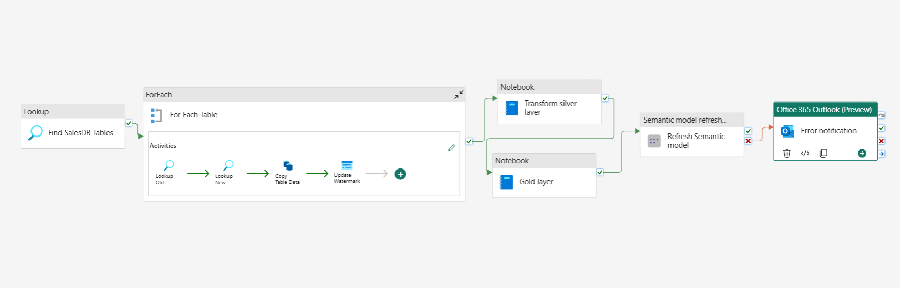
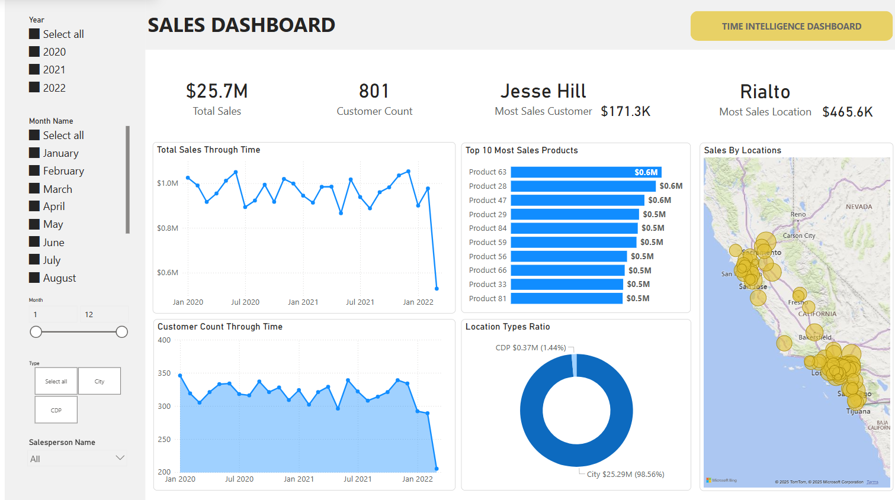
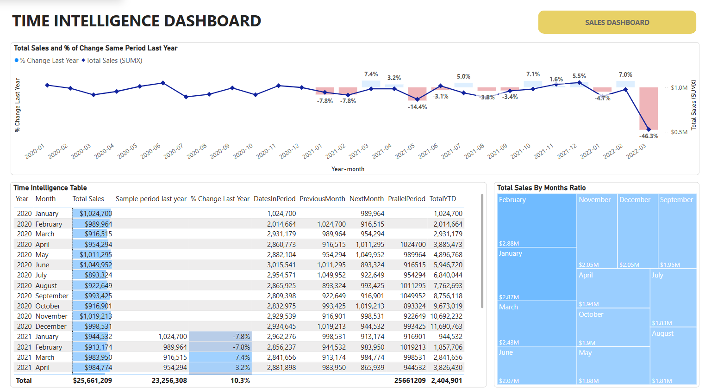

# Data Analytics Project with Microsoft Fabric

## 1. Overview

This project leverages **Microsoft Fabric**, a Software-as-a-Service (SaaS) solution that centralizes an organization’s data and makes it easy to manage and extract value from that data. Fabric offers **7 primary workloads**, each designed for a specific stage of the data lifecycle. In this project, we focus on **3 core workloads**:

1. **Data Factory**: Automates ETL processes or data pipelines. This workload cleans and standardizes data, ensuring consistency and quality for subsequent analysis.  
2. **Data Engineering**: Builds and maintains the data infrastructure, particularly the Lakehouse architecture, and runs code on Spark notebooks for large-scale data processing.  
3. **Power BI**: A leading data visualization tool that makes it simple for enterprises to derive insights through interactive dashboards and reports.

## 2. Medallion Architecture

This project adopts the **Medallion architecture**, which organizes data into layers (Bronze, Silver, and Gold) based on its quality and processing stage. This structure ensures consistency, independence, and sustainability as data progresses through multiple transformations before being stored in an optimized layout for efficient analysis.

1. **Bronze Layer** (Raw Data Ingestion)  
   - Contains unvalidated raw data from various sources.  
   - Preserves the original state of source data.  
   - Grows incrementally over time.

2. **Silver Layer** (Validated and De-duplicated Data)  
   - Holds cleaned, validated data from the Bronze layer.  
   - Removes duplicates and enriches data with additional information.  
   - May contain multiple data tables serving various analytics needs.

3. **Gold Layer** (Finalized for Analytics — Dimensional Modeling)  
   - Data is fully refined, ready for consumption.  
   - Often includes **Dimensional Modeling** (fact and dimension tables).  
   - Aggregated data optimized for advanced analytics and reporting.

## 3. Data Pipeline with Microsoft Fabric

### 3.1 Automated Data Pipelines with Data Factory

  
*Figure: An Azure Data Factory pipeline showing Lookup, ForEach, Copy Data, Upsert Watermark, transformations in Silver/Gold layers, and a semantic model refresh.*

1. **Lookup**: Retrieves a list of tables (e.g., from a control or metadata table) to ingest.  
2. **ForEach Table**:
   - **Lookup Old Watermark**: Identifies the last processed record (timestamp or numeric key).  
   - **Copy Data**: Copies only new or changed records into the **Bronze** layer.  
   - **Upsert Watermark**: Updates or inserts the latest watermark, ensuring incremental loads in subsequent runs.

3. **Transform Silver Layer**: Cleanses and standardizes data from the Bronze layer, removing duplicates and inconsistencies.  
4. **Transform Gold Layer**: Applies business logic, dimensional modeling, and advanced transformations to produce analytics-ready data.  
5. **Semantic Model Refresh**: Updates the downstream semantic model (e.g., Azure Analysis Services or Power BI datasets) so that reports and dashboards reflect the latest data.  
6. **Error Notification**: If any step fails, an email alert is sent through Office 365, enabling rapid troubleshooting.

### 3.2 Data Engineering

- **Lakehouse**: Stores data in a unified platform, offering both structured and unstructured data handling.  
- **Spark Notebooks**: Execute large-scale transformations and analytics on the Lakehouse data, ensuring scalable and efficient processing.

## 4. Data Visualization with Power BI

Below are examples of **Sales Dashboard** and **Time Intelligence Dashboard** built in **Power BI**:

  
*Figure: A Sales Dashboard showing total sales, customer count, top products, and revenue distribution by location.*

  
*Figure: A Time Intelligence Dashboard displaying year-over-year comparisons, monthly breakdowns, and a calendar view of sales.*

## 4. Dashboard Use Cases

This project uses public e-commerce data to drive actionable business insights. The dashboards address key analytical needs, including:

### 4.1 Sales Dashboard Overview

- **Total Revenue & Order Volume**: Visualize overall sales performance and order trends.
- **Top Customer & Regional Insights**: Identify key customer segments and assess performance by region.
- **Product Trends**: Highlight best-selling items and monitor emerging product trends.

### 4.2 Time Intelligence Dashboard Overview

- **Year-over-Year Comparisons**: Analyze growth and performance changes over time.
- **Monthly & Seasonal Patterns**: Detect trends and seasonal variations to inform marketing strategies.
- **Period Comparison Tables**: Provide clear side-by-side comparisons of performance metrics across different periods.

## 5. Key Benefits

1. **Convenience of SaaS**: With Microsoft Fabric, data is centralized and easily accessible for all data-related operations.  
2. **Efficient & Reliable**: Incremental loading (via watermark) speeds up ingestion and lowers costs.  
3. **Medallion Architecture**: A clear, layered approach ensures data is validated step by step, from raw (Bronze) to analytics-ready (Gold).  
4. **Automated & Scalable**: Data Factory pipelines and Spark notebooks handle large-scale data with minimal manual intervention.  
5. **Actionable Insights**: Power BI dashboards deliver interactive, real-time analytics that empower decision-making.  
6. **Easy Maintenance**: Onboarding new data sources is as simple as updating a control table; the pipeline handles the rest.

## 6. Conclusion

By combining **Microsoft Fabric**, the **Medallion architecture**, and **Power BI**, this project demonstrates a comprehensive end-to-end data solution. From raw data ingestion to dimensional modeling and real-time analytics, the process is streamlined, scalable, and robust—ensuring high-quality data is readily available for decision-makers. 
